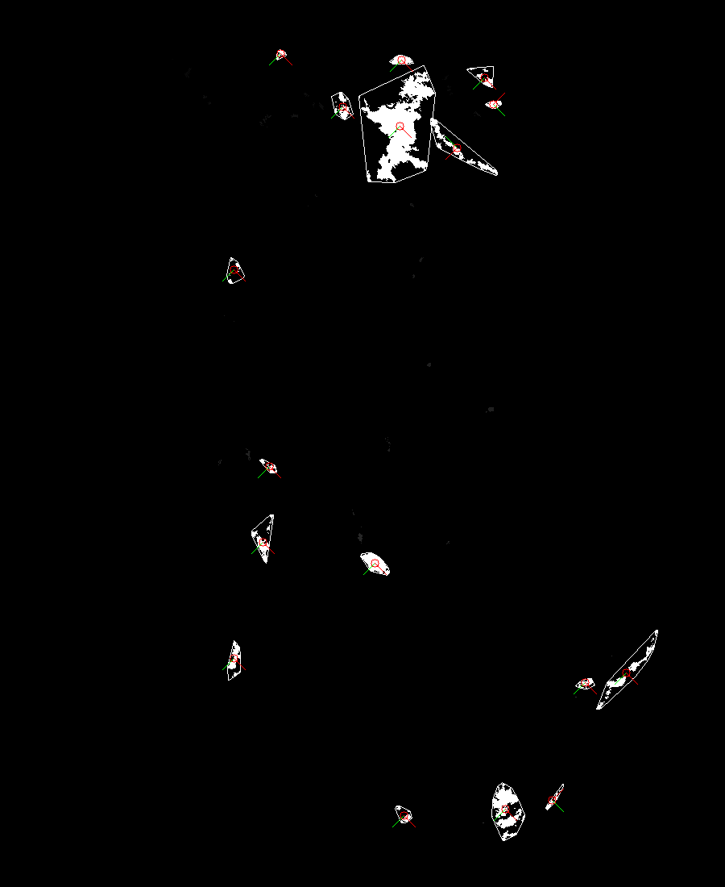

* Wolken werden mit sequentiellem labeling markiert und anhand ihrer größer gefärbt
* Wolken werden in zwei aufeinanderfolgenden Bildern gefunden
* Probleme, wenn Wolken auseinanderbrechen

#### Optischer Fuss 
    

